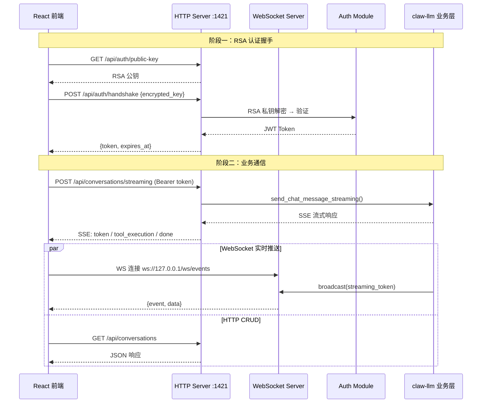
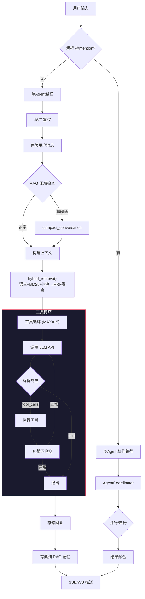
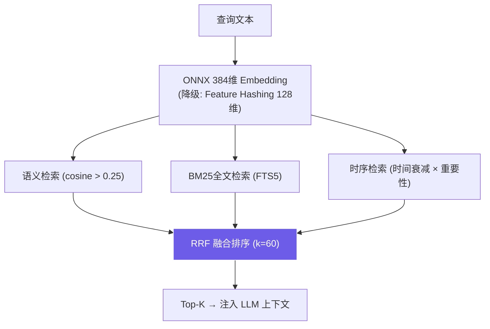

# Claw Desktop — AI Agent 工作台

[](https://github.com/claw-desktop/qclaw-desktop)
[](https://doc.rust-lang.org/edition-guide/rust-2024/)
[](https://v2.tauri.app/)
[](https://react.dev/)
[](https://www.typescriptlang.org/)
[](./LICENSE)

> 基于 Tauri 2.x 的多模型 AI Agent 桌面工作台，支持工具循环、RAG 记忆、Skills 系统、多 Agent 协作及多渠道接入。

`Rust 2024` · `React 18` · `TypeScript 5.6` · `Tailwind CSS 3.4` · `SQLite + Sea-ORM` · `ONNX Runtime` · `Axum` · `Three.js`

---

## 快速开始

### 环境要求

| 依赖 | 最低版本 | 说明 |
|------|---------|------|
| **Rust** | 1.85+ | `rustup update stable` |
| **Node.js** | 18+ | 推荐 20 LTS |
| **pnpm** | 8+ | `npm install -g pnpm` |
| **VS Build Tools** | 2022 | Windows C++ 编译工具 (含 Clang) |
| **SQLite** | — | Sea-ORM 自带，无需单独安装 |

<details>
<summary>📦 各平台环境配置</summary>

**Windows**：
```powershell
winget install Rustlang.Rustup && rustup default stable
winget install OpenJS.NodeJS.LTS
npm install -g pnpm
winget install Microsoft.VisualStudio.2022.BuildTools   # 需含 "C++ 桌面开发" 工作负载
```

**Linux (Ubuntu/Debian)**：
```bash
sudo apt update && sudo apt install -y libwebkit2gtk-4.1-dev build-essential curl wget file libxdo-dev libssl-dev libayatana-appindicator3-dev librsvg2-dev
curl --proto '=https' --tlsv1.2 -sSf https://sh.rustup.rs | sh
curl -o- https://raw.githubusercontent.com/nvm-sh/nvm/v0.40.0/install.sh | bash && nvm install --lts
npm install -g pnpm
```

**macOS**：
```bash
brew install pkg-config
curl --proto '=https' --tlsv1.2 -sSf https://sh.rustup.rs | sh
brew install node
npm install -g pnpm
```

</details>

### 安装与运行

```bash
git clone <repository-url> && cd qclaw-desktop
pnpm install
pnpm tauri dev
```

首次启动将自动：编译 Rust 后端（约 5-10 分钟）→ 启动 Vite 前端 (`:1420`) → 启动 Axum HTTP/WS 后端 (`:1421`) → 生成 RSA 密钥对 → 初始化 SQLite 数据库。

### 常用命令

| 命令 | 用途 |
|------|------|
| `pnpm tauri dev` | 开发模式（热重载） |
| `pnpm dev` | 仅前端开发服务器 |
| `pnpm build` | 前端生产构建 |
| `cd src-tauri && cargo check` | Rust 编译检查 |
| `cd src-tauri && cargo test` | 运行 Rust 测试 |
| `pnpm tauri build` | 完整生产构建 |
| `RUST_LOG=debug pnpm tauri dev` | 调试日志模式 |
| `RUST_LOG=claw_llm=debug,claw_tools=trace pnpm tauri dev` | 指定模块日志 |

---

## 核心能力

| 能力 | 说明 |
|------|------|
| 🤖 **多模型支持** | Anthropic Claude、OpenAI GPT 系列及自定义 API 兼容模型 |
| 🔧 **工具循环** | 28+ 内置工具（Shell、文件、搜索、Git、Web、Agent 编排），最多 15 轮自动工具调用 |
| 🧠 **RAG 记忆** | ONNX 384维本地 embedding + BM25 + 时序三路融合检索，自动上下文压缩 |
| 📋 **Skills 系统** | 16 个内置技能 + 用户自定义技能 + MCP 动态技能 |
| 👥 **多 Agent 协作** | @mention 触发多 Agent 并行/串行协作，跨 Agent 记忆检索 |
| 📡 **多渠道接入** | Telegram、Discord、企业微信插件，统一消息处理管线 |
| 🖥️ **UI 自动化** | OCR + 屏幕捕获 + 输入模拟 + Mano-P GUI-VLA 模型集成 |
| 🌐 **3D 可视化** | Three.js Agent 节点可视化 |
| 🛡️ **错误学习引擎** | 自动捕获错误、生成规避规则、Jaccard 相似度匹配、DB 持久化 |
| ✅ **输出验证系统** | 格式/安全/一致性/工具参数/长度/自定义正则六维验证 |

---

## 系统架构

### 整体架构

```mermaid
graph TB
    subgraph Frontend["前端 (React 18 + TypeScript)"]
        App["App.tsx"]
        ChatArea["ChatArea"]
        MentionInput["MentionInput"]
        Sidebar["Sidebar"]
        SettingsPanel["SettingsPanel (14子面板)"]
        MemoryPanel["MemoryPanel"]
        HarnessDashboard["HarnessDashboard"]
        AgentViz3D["AgentVisualization3D"]
        Stores["Zustand Stores (6个)"]
        Hooks["Custom Hooks (9个)"]
        API["api/ (24模块)"]
        WSClient["ws/ (6模块)"]
    end

    subgraph Backend["后端 (Rust Workspace 11 Crates)"]
        ClawTypes["claw-types<br/>共享类型层"]
        ClawTraits["claw-traits<br/>抽象接口层"]
        ClawConfig["claw-config<br/>配置管理"]
        ClawDB["claw-db<br/>数据库层"]
        ClawRAG["claw-rag<br/>RAG记忆系统"]
        ClawLLM["claw-llm<br/>LLM交互核心"]
        ClawHarness["claw-harness<br/>Agent管理"]
        ClawTools["claw-tools<br/>工具系统"]
        ClawWS["claw-ws<br/>WS+HTTP服务层"]
        ClawChannel["claw-channel<br/>渠道插件系统"]
        ClawAuto["claw-automatically<br/>UI自动化引擎"]
    end

    subgraph External["外部服务"]
        LLM_API["LLM API<br/>(Anthropic/OpenAI)"]
        Telegram["Telegram"]
        Discord["Discord"]
        Weixin["企业微信"]
    end

    subgraph Storage["存储层"]
        MainDB[("claw.db")]
        AgentDB[("agent_{id}.db")]
        ConfigFile["config.toml"]
    end

    API -->|"HTTP REST :1421"| ClawWS
    WSClient -->|"WebSocket"| ClawWS
    ClawLLM -->|"API调用"| LLM_API
    ClawChannel --> Telegram
    ClawChannel --> Discord
    ClawChannel --> Weixin
    ClawDB --> MainDB
    ClawDB --> AgentDB
    ClawConfig --> ConfigFile

    style Frontend fill:#1a1a2e,stroke:#e94560,color:#fff
    style Backend fill:#16213e,stroke:#0f3460,color:#fff
    style External fill:#1a1a1a,stroke:#e94560,color:#aaa
    style Storage fill:#0a0a0a,stroke:#533483,color:#aaa
```



### Crate 依赖层次

```
Layer 0: claw-types (零依赖基础层)
Layer 1: claw-traits, claw-config (依赖 claw-types)
Layer 2: claw-db (依赖 claw-types + claw-config)
         claw-automatically (依赖 claw-types + claw-traits)
Layer 3: claw-rag (依赖 claw-types + claw-config + claw-db)
         claw-channel (依赖 claw-config + claw-db)
Layer 4: claw-llm (依赖 claw-types + claw-traits + claw-config + claw-db + claw-rag)
         claw-tools (依赖 claw-types + claw-traits + claw-config + claw-db)
Layer 5: claw-harness (依赖 claw-types + claw-config + claw-llm + claw-db + claw-rag)
Layer 6: claw-ws (依赖所有其他 crate — "组装层")
```

<details>
<summary>📐 详细架构图与数据流</summary>

#### 通信架构



#### 核心聊天消息流



#### RAG 记忆检索流



</details>

---

## 项目结构

```
qclaw-desktop/
├── src-tauri/                         # Rust 后端 (Tauri)
│   ├── src/
│   │   ├── main.rs                    # 程序入口
│   │   ├── app_state.rs               # 应用状态 + EventBus
│   │   ├── commands.rs                # Tauri 命令
│   │   └── bin/generate_keys.rs       # RSA 密钥对生成工具
│   ├── crates/                        # Workspace 内部 crate (11个)
│   │   ├── claw-types/                # 共享类型层 (零依赖)
│   │   ├── claw-traits/               # 抽象接口层
│   │   ├── claw-config/               # 配置管理
│   │   ├── claw-db/                   # 数据库层 (Sea-ORM + SQLite)
│   │   ├── claw-rag/                  # RAG 记忆系统
│   │   ├── claw-llm/                  # LLM 交互核心
│   │   ├── claw-harness/              # Agent 管理
│   │   ├── claw-tools/                # 工具系统 (28+工具)
│   │   ├── claw-ws/                   # WebSocket + HTTP 服务层 (23路由)
│   │   ├── claw-channel/              # 渠道插件系统
│   │   └── claw-automatically/        # UI 自动化引擎
│   ├── bundled-skills/                # 内置技能 (16个)
│   ├── Cargo.toml                     # Workspace 配置
│   └── tauri.conf.json                # Tauri 应用配置
├── src/                               # React 前端
│   ├── App.tsx                        # 根组件
│   ├── main.tsx                       # React 入口
│   ├── api/                           # API 封装层 (24模块)
│   ├── components/                    # UI 组件
│   │   ├── chat/                      # 聊天组件
│   │   ├── config/panels/             # 配置面板 (14子面板)
│   │   ├── dashboard/                 # 仪表盘
│   │   ├── layout/                    # 布局组件
│   │   ├── panels/                    # 浮层面板
│   │   ├── settings/                  # 设置组件
│   │   ├── setup/                     # 初始化向导
│   │   └── visualization/             # 3D 可视化
│   ├── hooks/                         # Custom Hooks (9个)
│   ├── stores/                        # Zustand Stores (6个)
│   ├── types/generated/               # ts-rs 自动生成类型 (15个)
│   ├── ws/                            # WebSocket 客户端 (6模块)
│   ├── multiagent/                    # 多 Agent 协作引擎 (8模块)
│   ├── i18n/                          # 国际化 (zh-CN/zh-TW/en)
│   └── index.css                      # 全局样式
├── docs/                              # 项目文档
├── config.toml                        # 默认配置模板
└── package.json                       # 前端依赖
```

### Crate 职责

| Crate | 职责 | 关键模块 |
|-------|------|---------|
| **claw-types** | 共享类型基础层 | `error.rs`, `events.rs`, `common.rs` |
| **claw-traits** | 抽象接口层 | `event_bus.rs`, `channel_ops.rs`, `automation.rs`, `llm_caller.rs`, `tool_executor.rs` |
| **claw-config** | 配置管理 | `config.rs`, `path_resolver.rs`, `ts_types.rs` |
| **claw-db** | 数据库层 | `database.rs`, `vector_store.rs`, `entities/`, `agent_entities/` |
| **claw-rag** | RAG 记忆系统 | `rag.rs`, `local_embedder.rs`, `memory_pipeline.rs`, `memory_layers.rs` |
| **claw-llm** | LLM 交互核心 | `llm.rs`, `engine.rs`, `tool_loop.rs`, `streaming.rs`, `loop_detector.rs` |
| **claw-harness** | Agent 管理 | `persona.rs`, `cron.rs`, `hooks.rs`, `error_learning.rs`, `cross_memory.rs`, `validation.rs`, `observability.rs` |
| **claw-tools** | 工具系统 | `tool_dispatcher.rs`, `skills.rs`, `mcp_client.rs`, `plugins/` |
| **claw-ws** | 通信服务层 | `ws/server.rs`, `ws/auth.rs`, `ws/routes/` (23路由) |
| **claw-channel** | 渠道插件系统 | `plugins/telegram.rs`, `plugins/discord.rs`, `plugins/weixin/` |
| **claw-automatically** | UI 自动化引擎 | `manop/`, `agent/`, `capture/`, `input/`, `platform/` |

### 前端架构

**状态层 (6 个 Zustand Store)**：`conversationStore` · `agentStore` · `configStore` · `uiStore` · `streamingStore` · `wsStore`

**逻辑层 (9 个 Custom Hooks)**：`useConversationManager` · `useStreamingRenderer` · `useMultiAgentCoordinator` · `useSettingsManager` · `useWebSocketEvents` · `useWebSocket` · `useAgentPersona` · `useAgentStatus` · `useErrorLearning`

**初始化顺序**：`wsEvents.initAuth()` → `loadConfig()` → `loadConversations()` → `loadAgents()`

---

## 技术栈

| 类别 | 技术 |
|------|------|
| 桌面框架 | Tauri 2.x |
| 后端语言 | Rust 2024 Edition |
| 前端框架 | React 18 + TypeScript 5.6 |
| 状态管理 | Zustand v5 |
| 样式方案 | Tailwind CSS 3.4 |
| 数据库 | SQLite + Sea-ORM + sqlite-vec |
| 向量化 | ONNX Runtime + all-MiniLM-L6-v2 (384维) + Feature Hashing (128维降级) |
| GUI-VLA | Mano-P 1.0 (明略科技开源) |
| 类型契约 | ts-rs (Rust → TypeScript 自动生成) |
| 异步运行时 | Tokio (full features) |
| HTTP 服务 | Axum |
| WebSocket | tokio-tungstenite |
| 3D 可视化 | Three.js + @react-three/fiber |
| 国际化 | i18next + react-i18next |
| 包管理 | pnpm (前端) / cargo (后端) |

---

## 数据目录

应用运行时在 `~/.claw-desktop/` 下创建：

```
~/.claw-desktop/
├── claw.db                    # 主数据库（会话、消息、记忆单元）
├── agent_{id}.db              # Agent 专属数据库（配置、画像、工作区）
├── keys/
│   ├── private_key.pem        # RSA 私钥（前后端认证）
│   └── public_key.pem         # RSA 公钥
├── models/
│   └── onnx/                  # ONNX Embedding 模型（自动下载）
├── skills/                    # 用户自定义技能（SKILL.md 格式）
├── logs/                      # 应用日志
└── config.toml                # 用户配置（首次运行自动生成）
```

---

## 开发规范

> 📖 完整规范详见 [AGENTS.md](./AGENTS.md)

| 规范 | 说明 |
|------|------|
| **IPC 通信** | 所有 Tauri invoke 调用封装在 `src/api/` 中，禁止组件直接调用 `invoke()` |
| **i18n** | 所有用户可见文本使用 `useTranslation()` hook，禁止硬编码 |
| **日志** | Rust 使用 `log::info!("[Module:Function] msg")` 格式，禁止 `println!` |
| **错误处理** | Tauri command 统一返回 `Result<T, String>`，禁止空 `catch` 和不必要的 `unwrap()` |
| **样式** | 仅使用 Tailwind CSS，禁止引入其他 CSS-in-JS 库 |
| **数据库** | 使用 Sea-ORM 参数化查询，禁止 SQL 字符串拼接 |
| **安全** | 禁止硬编码 API Key，日志中脱敏处理密钥 |

### 关键常量（禁止未经评审修改）

```rust
const MAX_TOOL_ROUNDS: usize = 15;
const TOTAL_LOOP_TIMEOUT_SECS: u64 = 180;
const MAX_SAME_TOOL_CONSECUTIVE: usize = 4;
const MAX_API_RETRIES: usize = 3;
```

---

## 需求状态

### 核心需求

| ID | 需求 | 优先级 | 状态 |
|----|------|--------|------|
| R-001 | 多模型 LLM 支持 (Anthropic/OpenAI/自定义) | P0 | ✅ |
| R-002 | 流式聊天消息 (SSE + WebSocket) | P0 | ✅ |
| R-003 | 工具循环 (Function Calling + 自动执行) | P0 | ✅ |
| R-004 | RAG 记忆系统 (语义+BM25+时序融合) | P0 | ✅ |
| R-005 | 多 Agent 协作 (@mention 触发) | P1 | ✅ |
| R-006 | Skills 技能系统 (内置+自定义+MCP) | P1 | ✅ |
| R-007 | 渠道接入 (Telegram/Discord/企业微信) | P1 | ✅ |
| R-008 | UI 自动化 (OCR+屏幕捕获+输入模拟) | P2 | ✅ |
| R-009 | Agent 隔离 (独立数据库+配置+技能) | P1 | ✅ |
| R-010 | 3D Agent 可视化 | P3 | ✅ |
| R-011 | Mano-P GUI-VLA 模型集成 | P2 | 🟡 框架完成，推理引擎待接入 |

### 非功能需求

| ID | 需求 | 目标值 | 状态 |
|----|------|--------|------|
| NFR-001 | 首次启动时间 | < 3s | ✅ |
| NFR-002 | 流式首 token 延迟 | < 2s | ✅ |
| NFR-003 | ONNX Embedding 延迟 | < 50ms/次 | ✅ |
| NFR-004 | 最大并发流式请求 | 10 (Semaphore) | ✅ |
| NFR-005 | 工具循环超时 | 180s | ✅ |
| NFR-006 | RSA + JWT 认证 | RSA-OAEP + JWT | ✅ |
| NFR-007 | i18n 国际化 | zh-CN/zh-TW/en | 🟡 zh-TW 约 55% |
| NFR-008 | 跨平台 | Windows/Linux/macOS | ✅ (Windows 优先) |

---

## FAQ

<details>
<summary><b>Q: 首次编译时间很长，如何加速？</b></summary>

首次编译约 5-10 分钟，后续增量编译会快很多。优化方式：
- 使用 `sccache`：`cargo install sccache && export RUSTC_WRAPPER=sccache`
- 使用更快的链接器（Windows: `lld`，Linux: `mold`）
- 仅修改前端时用 `pnpm dev` 而非 `pnpm tauri dev`

</details>

<details>
<summary><b>Q: 支持哪些 LLM 模型？</b></summary>

1. **Anthropic Claude**：Claude 3.5 Sonnet、Claude 3 Opus 等
2. **OpenAI GPT**：GPT-4o、GPT-4 Turbo、GPT-3.5 Turbo 等
3. **自定义 API 兼容模型**：任何兼容 OpenAI/Anthropic API 格式的服务（DeepSeek、Qwen、本地 Ollama 等）

</details>

<details>
<summary><b>Q: 如何添加自定义技能？</b></summary>

将 SKILL.md 格式的技能文件放入 `~/.claw-desktop/skills/` 目录。同名技能内置优先，用户自定义不会覆盖内置技能。格式参见 [AGENTS.md](./AGENTS.md) 中的 Skills 系统规则。

</details>

<details>
<summary><b>Q: 如何配置渠道机器人？</b></summary>

在设置面板的"渠道"子面板中配置。Telegram: Bot Token (@BotFather)；Discord: Bot Token (Developer Portal)；企业微信: Webhook URL + 回调密钥。详见 [README-channel.md](./README-channel.md)。

</details>

### 故障排除

| 问题 | 解决方案 |
|------|---------|
| `linker 'cc' not found` | Windows: 安装 VS Build Tools 2022；Linux: `sudo apt install build-essential` |
| 前端白屏/无法连接后端 | 检查 `http://127.0.0.1:1421` 是否可达，查看 Rust 日志 |
| RSA 密钥对生成失败 | 删除 `~/.claw-desktop/keys/` 后重启 |
| ONNX Embedding 初始化失败 | 删除 `~/.claw-desktop/models/` 后重启（自动重新下载） |
| WebSocket 连接断开 | 应用会自动重连；持续断开检查防火墙设置 |
| 工具循环超时 (180s) | 检查工具输出是否过大 |
| 数据库锁定错误 | 确保只有一个 Claw Desktop 实例在运行 |
| 中文显示乱码 | Windows: `chcp 65001`；Linux: 检查 `LANG` 环境变量 |

---

## 相关文档

### 项目文档

| 文档 | 路径 | 说明 |
|------|------|------|
| 开发规范 | [AGENTS.md](./AGENTS.md) | AI Agent 工作强制规则 |
| 重构方案 | [docs/plan.md](./docs/plan.md) | claw-core 拆分为独立 crate 的方案 |
| Harness 架构 | [docs/harness-engineering-architecture.md](./docs/harness-engineering-architecture.md) | Harness Engineering 架构设计 |
| Harness 方法论 | [docs/harness-methodology-diagram.md](./docs/harness-methodology-diagram.md) | Harness 方法论图表 |

### 子系统文档

| 文档 | 路径 | 说明 |
|------|------|------|
| 渠道系统 | [README-channel.md](./README-channel.md) | 渠道插件系统设计（Telegram/Discord/企业微信） |
| 桌面自动化架构 | [README-test.md](./README-test.md) | claw-automatically 模块架构设计 |
| 桌面自动化需求 | [README-click.md](./README-click.md) | 桌面自动化系统需求说明 |
| 多媒体处理 | [README-data.md](./README-data.md) | 图片/视频/文件处理架构 |
| 项目重构方案 | [README-mv.md](./README-mv.md) | 项目结构重构/循环依赖解决方案 |
| 开发路线图 | [README-dev.md](./README-dev.md) | 开发路线图与优化方案 |
| 模型推理引擎 | [README-deploy-model.md](./README-deploy-model.md) | 原生模型推理引擎与部署系统设计 |
| 优化待办 | [OPTIMIZATION_TODO.md](./OPTIMIZATION_TODO.md) | 优化审查报告与待办事项 |

---

## 许可证

本项目为私有软件，未经授权不得复制、修改或分发。

Copyright © 2024-2026 Claw Desktop. All rights reserved.
